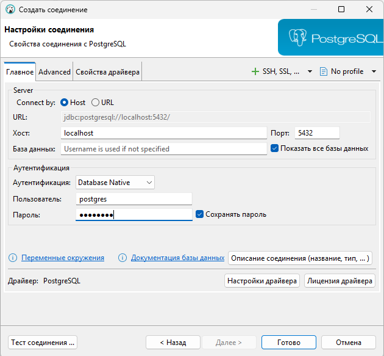
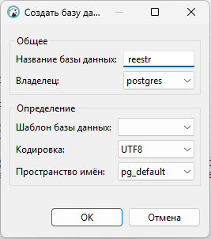
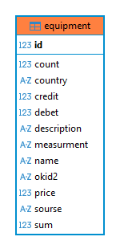

# Connecting to the database
This guide provides detailed instructions for setting up and connecting to a database using 
**Docker** and **DBeaver**. Remember that you can also modify settings in  **application.properties**.
## Creating the container
To create the container, start Docker, open a terminal, and paste the following command:
```
docker run -p 5432:5432 -e POSTGRES_USER=postgres -e POSTGRES_PASSWORD=postgres -d -v reestr-postgres-data:/var/lib/postgresql/data --name reestr postgres:latest
```
Then start the container and open DBeaver.
## Connection
In DBeaver, click on New Connection. Then enter the correct information:
- host - localhost or 127.0.0.1
- port - 5432
- It is recommended to leave the *Database* field empty and check the box next to *Show all database*
- authentication - Database Native
- username and password - postgres
  
  

After that, it is recommended to test the connection.
## Creating the database
Click on the newly created connection. Right-click on 
*create a database object*. Specify the name (*reestr*).  

  
Then right-click on the newly created database and set it as the default.
## Result
After completing the steps above, the database is ready to use.  
When you run the application, a table is created, which you can 
find in the Tables section of your database:  
